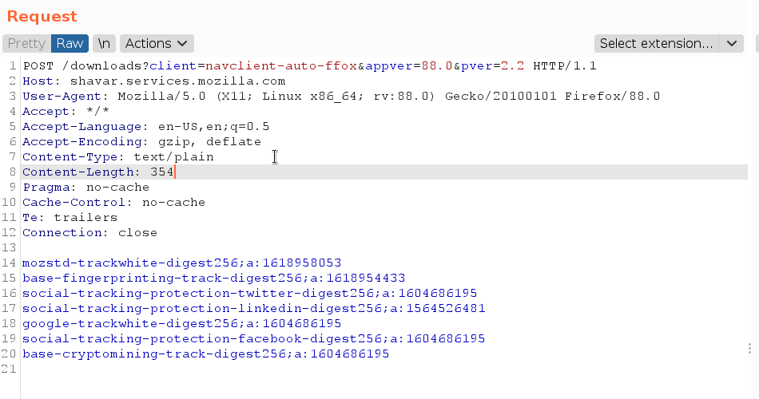

# HopLa V2

💥 All the power of PayloadsAllTheThings, without the overhead. 
This extension adds autocompletion support and useful payloads in Burp Suite to make your intrusion easier.

Feel free to improve with your payloads ! ❤️

Developed by Alexis Danizan [](https://twitter.com/alexisdanizan/)  
Released as open source by [Synacktiv 🥷](https://www.synacktiv.com/) 




## Getting started

### Installation

 * Download the jar file from the release directory
 * Add it to Burp Suite using the Extender tab

### Build

Build with Docker or Podman:

```bash
$ podman build -t hopla .

$ podman run --rm  -v "$PWD":/data hopla gradle build
Starting a Gradle Daemon (subsequent builds will be faster)
> Task :compileJava

> Task :encryptResource
Encrypting /data/src/main/resources/default-payloads.yaml to /data/build/encryptedResources/default-payloads.enc.yaml

> Task :processResources
> Task :classes
> Task :jar
> Task :assemble
> Task :compileTestJava NO-SOURCE
> Task :processTestResources NO-SOURCE
> Task :testClasses UP-TO-DATE
> Task :test NO-SOURCE
> Task :check UP-TO-DATE
> Task :build

BUILD SUCCESSFUL in 11s
4 actionable tasks: 4 executed

$ ls build/libs/
HopLa-2.0.0.jar
```

Execute `gradle build` and you'll have the plugin ready in `build/libs/HopLa-2.0.0.jar`.

## Usage

By default HopLa is shipped with default payloads. You can add yours by loading a custom JSON file in the the menu. 

At the first usage HopLa creates a JSON file containing all the payloads in the jar file directory.

Press `Ctrl+Q` to display the payload library menu.

You can disable the global autocompletion in the top menu.

For i3, add the following line to `$HOME/.config/i3/config` for floating frame:

```
for_window [class=".*burp-StartBurp.*" title="^ $"] floating enable
```

### How to add payloads

The YAML payloads file follow the structure:

```yaml
shortcut_search_and_replace: Ctrl+L
shortcut_payload_menu: Ctrl+Q
shortcut_collaborator: Ctrl+M
shortcut_ia_chat: Ctrl+J

categories:
  - name: "XSS"
    payloads:
      - name: "Fingerprint"
        value: "\"><h1>"
        shortcut: Ctrl+k

keywords:
  - name: "Headers"
    values:
      - "Accept"
      - "Accept-Charset"
```

There is no nesting limit.

To add only keywords that do not appear in the menu, you can add them in the keywords category:

```yaml
keywords:
  - name: "Headers"
    values:
      - "Accept"
      - "Accept-Charset"
```

## Thanks To

 * https://github.com/Static-Flow/BurpSuiteAutoCompletion
 * https://github.com/d3vilbug/HackBar
 * https://github.com/swisskyrepo/PayloadsAllTheThings

Thanks a lot for your awesome work !

## License

Released under BSD 3-Clause License see LICENSE for more information

Please feel free to report bugs, suggest features, or send pull requests.
